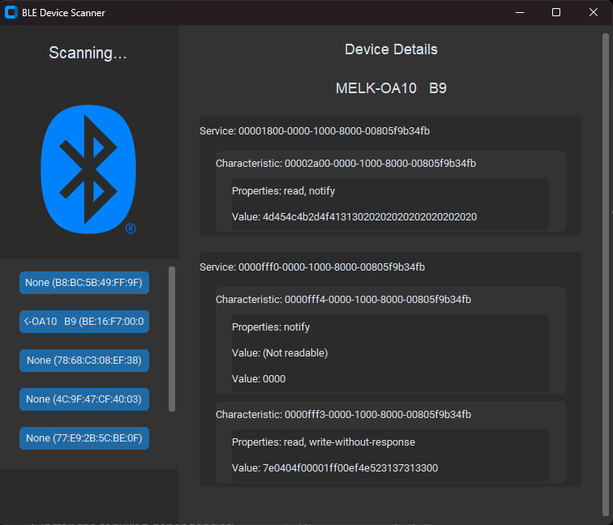

<h1>BLE Device Scanner</h1> 
The BLE Device Scanner is a Python-based desktop application that allows you to discover and interact with nearby Bluetooth Low Energy (BLE) devices. It provides a user-friendly interface for exploring the services, characteristics, and properties of BLE peripherals.
 <h2>Features</h2> <ul> <li> <strong>Scan for nearby BLE devices</strong> 
Easily scan for nearby BLE devices and display them in a list.
 </li> <li> <strong>Display services, characteristics, and properties</strong>    
Explore the services, characteristics, and properties of connected BLE devices.
 </li> </ul> <h2>BLE Concepts</h2> <ul> <li> <strong>Service</strong> 
A service is a collection of related characteristics that define a specific functionality of a BLE device. Services are identified by a unique UUID (Universally Unique Identifier).
 </li> <li> <strong>Characteristic</strong> 
A characteristic is a data value that belongs to a specific service. It represents a particular aspect or data point of the service. Characteristics are also identified by a unique UUID.
 </li> <li> <strong>Property</strong> 
Properties define the permissions and capabilities of a characteristic. They indicate whether a characteristic can be read, written, notified, or indicated.
 </li> <li> <strong>Value</strong> 
The value is the actual data stored in a characteristic. It can be read from or written to a characteristic, depending on its properties.
 </li> </ul> <h2>Installation</h2> <ol> <li>Clone the repository: <code>git clone https://github.com/ahmadalharbi21/BLE_DEVICE_SCANNER.git</code></li> <li>Install the required dependencies: <code>pip install -r requirements.txt</code></li> </ol> <h2>Usage</h2> <ol> <li>Run the application: <code>python main.py</code></li> <li>Click the "Scan" button to discover nearby BLE devices</li>  <li>Explore the services, characteristics, and properties of the connected device</li> </ol> <h2>Dependencies</h2> <ul> <li>Python 3.x</li> <li>bleak library</li> <li>Pillow</li><li>Customtkinter</li> </ul> <h2>Contributing</h2> 
Contributions are welcome! If you find any issues or have suggestions for improvements, please open an issue or submit a pull request.
 <h2>License</h2> 
This project is licensed under the MIT License. See the <a href="LICENSE">LICENSE</a> file for more information.
 <h2>Contact</h2> 
If you have any questions or inquiries:
 <ul> <li>Name: Ahmad Alharbi</li> <li>GitHub: <a target="_blank" href="https://github.com/ahmadalharbi21">ahmadalharbi21</a></li> <li>LinkedIn: <a target="_blank" href="https://www.linkedin.com/in/ahmad-alharbi-44723125a/">LinkedIn</a></li> </ul> 
Feel free to reach out with any feedback or concerns.

